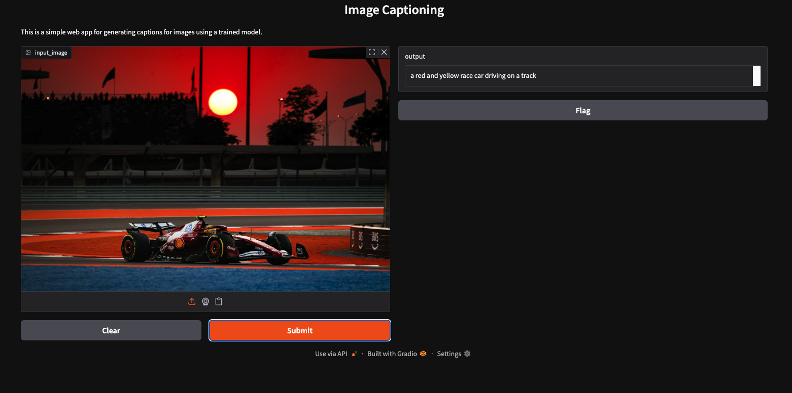

# Project Summary:

An image captioner using BLIP - a multimodal model from salesforce. Takes an Image as an input and returns a text describing the text. 

### Tech Stack:

1. Gradio - To build an user interface for the app quickly
2. tranformers - The hugging face library to use AI models
3. torch & torchvision - dependencies for the BLIP and AutoProcessor
4. numpy - to handle the image
5. Pillow - to handle the image object in python

### How to run:
- python app.py

# Output:
